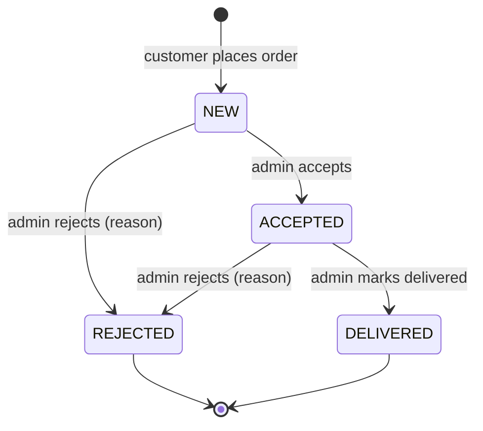
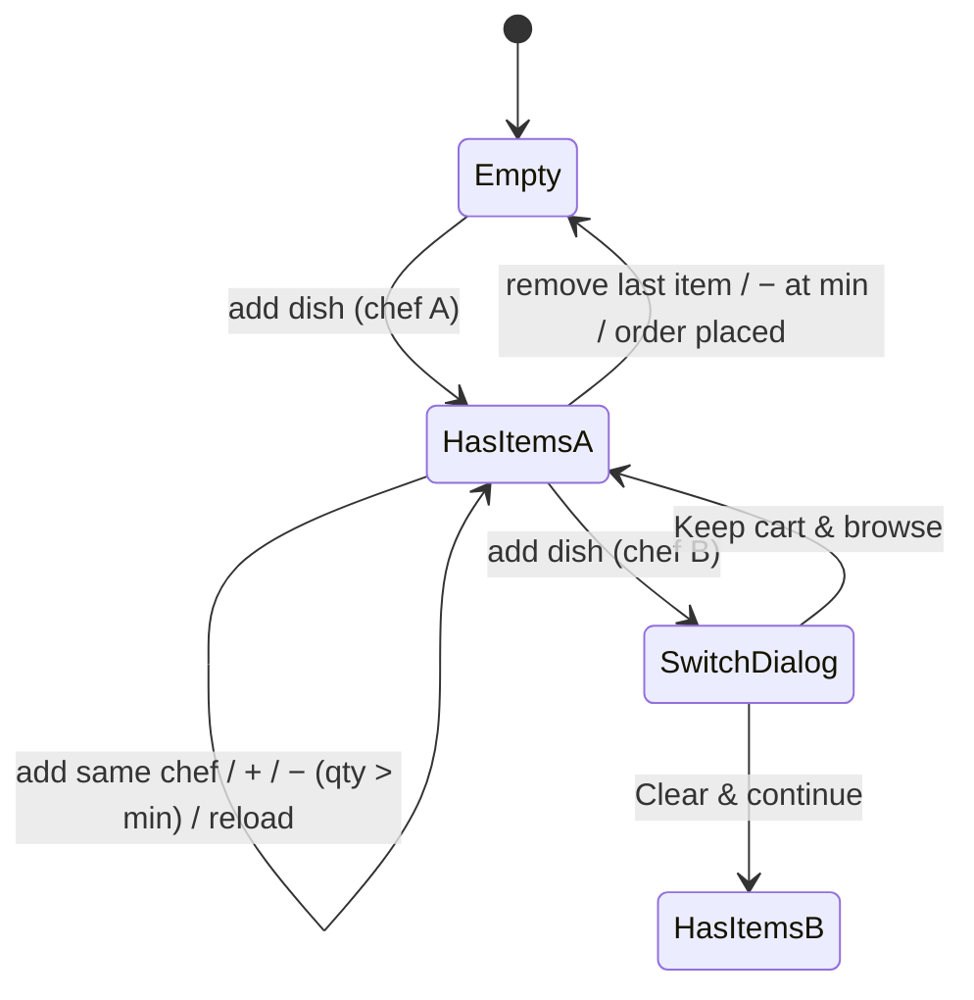

# State Transition Testing

**ISTQB:** CTFL 4.2.4
**Input:** [test-conditions.md](../02-analysis/test-conditions.md) · **Output:** test cases in [test-cases.md](../test-cases.md)

## How to read this document

A **state transition diagram** shows the states of an object and the events
that move it between states. A **state table** shows every state × event
combination, so invalid transitions become visible too.

Coverage criteria used (CTFL v4.0):

| Criterion | Meaning |
|---|---|
| All states coverage | Every state is visited at least once |
| Valid transitions coverage (0-switch) | Every valid transition is exercised at least once |
| All transitions coverage | Every valid transition is exercised **and** every invalid transition is attempted |

---

## ST-1 — Order status in the back office (REQ-16 · TCOND-21)

Source: `AdminOrderService.ALLOWED_TRANSITIONS`, `apps/admin/src/constants/OrderStatus.jsx`.

### Diagram

### State table

Event = `PATCH /admin/order/{id}/status` with the target status. ✔ = valid (200), ✘ = invalid (400 "Cannot transition order from X to Y", status unchanged).

| Current \ Target | NEW | ACCEPTED | REJECTED | DELIVERED |
|---|---|---|---|---|
| **NEW** | ✘ | ✔ T1 | ✔ T2 | ✘ |
| **ACCEPTED** | ✘ | ✘ | ✔ T4 | ✔ T3 |
| **REJECTED** | ✘ | ✘ | ✘ | ✘ |
| **DELIVERED** | ✘ | ✘ | ✘ | ✘ |

Valid transitions: 4 (+ T0 "order created → NEW"). Invalid transitions: 12.
Plus one invalid **event**: unknown status (`CANCELLED`) → 400.

### Test sequences

| Seq | Path | Covers | Test case |
|---|---|---|---|
| S1 | T0 NEW → T1 ACCEPTED → T3 DELIVERED → *try* REJECTED | T0, T1, T3 + invalid DELIVERED→REJECTED | TC-27, TC-28 |
| S2 | T0 NEW → T2 REJECTED → *try* ACCEPTED | T2 + invalid REJECTED→ACCEPTED | TC-27, TC-28 |
| S3 | T0 NEW → T1 ACCEPTED → T4 REJECTED | T4 | TC-27 |
| S4 | NEW → *try* DELIVERED (skip a step) | invalid NEW→DELIVERED | TC-28 |
| S5 | All 16 cells of the state table + unknown status | all transitions | JUnit `AdminOrderServiceTransitionTest` (component) |

**Coverage:** all states 4/4 · valid transitions 4/4 (S1–S3) · all transitions 16/16 (S5).

---

## ST-2 — Storefront cart (REQ-04, REQ-05, REQ-06 · TCOND-04, TCOND-06)

Source: `apps/web/src/hooks/useCart.ts`, `apps/web/src/pages/Chef/index.tsx`.

| # | From | Event | To | Test case |
|---|---|---|---|---|
| C1 | Empty | add dish (A) | HasItems(A) | TC-03 |
| C2 | HasItems(A) | + / add same dish | HasItems(A), qty + 1 | TC-04 |
| C3 | HasItems(A) | − with qty > min | HasItems(A), qty − 1 | TC-04 |
| C4 | HasItems(A) | − with qty = min (last item) | Empty | TC-04 |
| C5 | HasItems(A) | trash (last item) | Empty | TC-05 |
| C6 | HasItems(A) | reload | HasItems(A), unchanged | TC-06 |
| C7 | HasItems(A) | add dish (B) | SwitchDialog | TC-07 |
| C8 | SwitchDialog | Keep cart & browse | HasItems(A) | TC-07 |
| C9 | SwitchDialog | Clear & continue | HasItems(B) | TC-07 |
| C10 | HasItems(A) | order placed | Empty | TC-09, TC-10 |
| C11 | HasItems(A) | open non-existent chef page | HasItems(A), **no** dialog | TC-02 |

**Coverage:** all states 4/4 · valid transitions 11/11.
